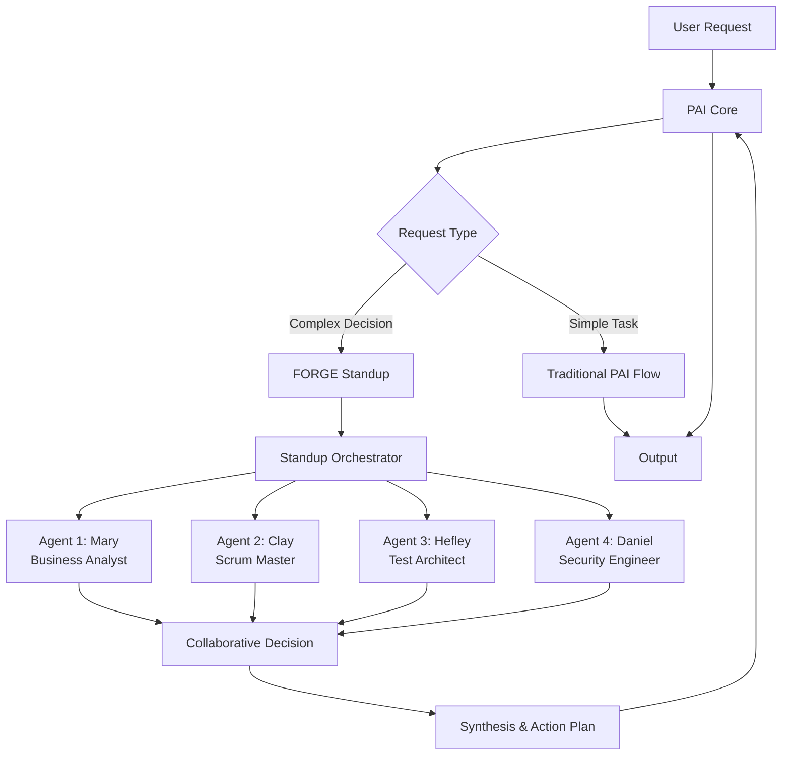

# FORGE Architecture

**FORGE** (Fused Optimization & Reasoning for Generative Engineering)
**Purpose**: Multi-agent collaboration layer for PAI (Personal AI Infrastructure)
**Integration**: Augments PAI, doesn't replace it

---

## Overview

FORGE adds multi-agent "standup" conversations to PAI, enabling specialist agents to collaboratively review decisions before implementation. Instead of solo AI responses, complex decisions get input from Security, Testing, Business, and Technical perspectives.

### Key Principle: Augmentation, Not Replacement

```
PAI Core (Unchanged)
├── Skills system (.claude/skills/)
├── Agent framework
├── Tool execution
└── Claude API

FORGE Layer (Augmentation)
├── Standup Skill (multi-agent orchestration)
├── Specialist Agents (Daniel, Hefley, Amy, Mary, Clay)
├── Domain Skills (AgilePm, Security, TestArchitect)
└── Integration with PAI's existing skills
```

**FORGE installs into PAI as standard skills** - no fork required.

---

## System Architecture

### High-Level Flow



### When to Use FORGE vs Traditional PAI

| Scenario | Use PAI Alone | Use FORGE Standup |
|----------|---------------|-------------------|
| Simple code change | ✅ | ❌ |
| Bug fix | ✅ | ❌ |
| Documentation update | ✅ | ❌ |
| **New feature design** | ❌ | ✅ |
| **Security-sensitive feature** | ❌ | ✅ |
| **Architecture decision** | ❌ | ✅ |
| **High-risk change** | ❌ | ✅ |

**Rule of thumb**: Use FORGE when you'd normally need multiple people in a meeting.

---

## Component Architecture

### 1. Standup Skill (Core Orchestration)

**Location**: `.claude/skills/Standup/`

**Purpose**: Multi-agent conversation orchestration

**Key Files**:
```
.claude/skills/Standup/
├── skill.md                    # Skill definition
├── METHODOLOGY.md              # Standup principles
├── workflows/
│   ├── RunStandup.md          # Main standup workflow
│   ├── SynthesizeDecision.md  # Decision synthesis
│   └── ManageContext.md       # Context management
├── agents/
│   ├── mary-business-analyst.md
│   ├── bob-scrum-master.md
│   ├── murat-test-architect.md
│   └── emma-security-engineer.md
└── templates/
    ├── custom-agent-template.md
    └── project-context-classified.md
```

**How it works**:
1. User invokes `/standup` command with a decision/feature
2. Orchestrator loads agent roster (default: Mary, Clay, Hefley, Daniel)
3. Each agent provides perspective in turn
4. Orchestrator synthesizes responses into actionable decision
5. Decision logged to `project-context.md` for audit trail

---

### 2. Specialist Agents

#### Agent Roster (Default)

| Agent | Role | Expertise | Focus |
|-------|------|-----------|-------|
| **Mary** | Business Analyst | User value, requirements | "Does this solve user pain?" |
| **Clay** | Scrum Master | Sprint planning, capacity | "Can we deliver this in time?" |
| **Hefley** | Test Architect | ATDD, risk-based testing | "How do we validate this works?" |
| **Daniel** | Security Engineer | STRIDE, CMMC compliance | "What could go wrong?" |

#### Agent Design Principles

**Persona Structure** (each agent has):
```markdown
# Agent Persona: [Name] ([Role])

**Expertise**: [Domain knowledge]
**Personality**: [Communication style]

## Behavioral Traits
[3-5 key characteristics]

## Decision-Making Framework
[How agent evaluates proposals]

## Communication Style
[Tone, phrases, anti-patterns]

## Integration with Other Agents
[How agent complements others]
```

**Example: Daniel (Security Engineer)**
- **Behavioral Trait**: Security-first mindset ("What could go wrong?")
- **Framework**: STRIDE threat modeling
- **Communication**: Educational (explains WHY, not just WHAT)
- **Integration**: Complements Mary (security supports user value), Clay (security affects timeline)

---

### 3. Domain Skills

#### AgilePm Skill

**Purpose**: Agile project management workflows

**Location**: `.claude/skills/AgilePm/`

**Workflows**:
- `CreatePrd.md`: Product Requirements Document generation
- `CreateEpics.md`: Epic decomposition (user-value driven)
- `CreateStories.md`: User story generation (INVEST principles)
- `SprintPlanning.md`: Sprint capacity planning

**Knowledge Base**:
- `prd-rubric.md`: 10-point quality scoring
- `epic-sizing.md`: S/M/L sizing guide

**Templates**:
- `prd-template.md`: Comprehensive PRD structure
- `epic-template.md`: Epic definition format
- `story-template.md`: User story format

---

#### Security Skill

**Purpose**: Security engineering workflows

**Location**: `.claude/skills/Security/`

**Workflows**:
- `ThreatModel.md`: STRIDE threat modeling
- `CmmcBaseline.md`: CMMC Level 2 compliance
- `SecurityReview.md`: Code security review
- `InfrastructureSecurity.md`: Infrastructure hardening

**Knowledge Base**:
- `cmmc-all-domains.md`: 110 CMMC Level 2 practices (17 domains)
- `secrets-management.md`: Secret handling best practices

**Templates**:
- `threat-model-template.md`: STRIDE analysis format

**Daniel Integration**: Daniel agent references this skill's knowledge base

---

#### TestArchitect Skill

**Purpose**: Test strategy and quality assurance

**Location**: `.claude/skills/TestArchitect/`

**Workflows**:
- `CreateTestStrategy.md`: Risk-based test planning
- `DefineCoverage.md`: Coverage analysis
- `AcceptanceTestDrivenDevelopment.md`: ATDD workflow
- `RiskBasedTesting.md`: Risk scoring (1-5 scale)
- `CiCdQualityGates.md`: Pipeline quality gates

**Hefley Integration**: Hefley agent references this skill's workflows

---

## Integration with PAI

### Installation Model

**FORGE installs as standard PAI skills**:
```bash
# User's PAI directory structure
~/.claude/skills/
├── Standup/           # FORGE core (contributed)
├── AgilePm/           # FORGE skill (contributed)
├── Security/          # FORGE skill (contributed)
├── TestArchitect/     # FORGE skill (contributed)
├── architect/         # PAI existing skill (unchanged)
├── engineer/          # PAI existing skill (unchanged)
└── researcher/        # PAI existing skill (unchanged)
```

**No conflicts**: FORGE skills work alongside existing PAI skills.

---

### Skill Invocation

**Traditional PAI**:
```bash
# User invokes architect skill
> /architect "Design a payment API"

# Single agent (architect) responds
```

**FORGE-enhanced PAI**:
```bash
# User invokes standup skill
> /standup "Design a payment API"

# Multi-agent standup (Mary, Clay, Hefley, Daniel) responds
# - Mary: User value perspective
# - Clay: Timeline and capacity
# - Hefley: Test strategy
# - Daniel: Security threats (STRIDE)
# Synthesis: Comprehensive implementation plan
```

**Coexistence**: User chooses when to use standup vs single agent.

---

### Context Management

**Project Context** (shared across agents):
```
docs/project-context.md
```

**Structure**:
```markdown
# Project Context: [Project Name]

## Decisions Made
- [Date] Decision: Use bcrypt for password hashing
  - Participants: Mary, Clay, Hefley, Daniel
  - Rationale: CMMC IA.L2-3.5.10 requires protected passwords
  - Status: Approved

## Architecture Decisions
- [Date] ADR-001: Use microservices architecture
  - Participants: Mary, Clay
  - Rationale: Scalability requirements

## Security Reviews
- [Date] STRIDE: Payment API
  - Reviewer: Daniel
  - Violations: 3 (0 Critical, 2 High, 1 Medium)
  - Status: High-risk violations fixed
```

**Benefits**:
- Audit trail (who decided what, when, why)
- Context for future decisions
- Compliance evidence (CMMC, SOC 2)

---

## Multi-Agent Orchestration

### Standup Flow

```
1. Invocation
   └─> User: "/standup Design payment API"

2. Context Loading
   └─> Load project-context.md
   └─> Load feature description

3. Agent Round Robin
   └─> Mary speaks first (user value)
   └─> Clay speaks second (capacity, timeline)
   └─> Hefley speaks third (test strategy)
   └─> Daniel speaks fourth (security)

4. Synthesis
   └─> Combine perspectives
   └─> Identify conflicts
   └─> Generate action plan

5. Decision Recording
   └─> Log to project-context.md
   └─> Include participants, rationale, status

6. Output
   └─> Comprehensive implementation plan
   └─> Action items
   └─> Risk mitigation
```

### Agent Turn-Taking Protocol

**Order matters**:
1. **Mary first**: Establishes user value baseline (others reference this)
2. **Clay second**: Timeline/capacity constraints (affects test strategy, security scope)
3. **Hefley third**: Test strategy based on Mary's value + Clay's constraints
4. **Daniel fourth**: Security analysis with full context from other agents

**Why this order**:
- Each agent builds on previous context
- Security (Daniel) has full picture before analyzing threats
- Testing (Hefley) knows scope before planning coverage

---

## Scalability & Extensibility

### Adding Custom Agents

**Template**: `.claude/skills/Standup/templates/custom-agent-template.md`

**Example: Add "Amy" (DevOps Engineer)**:
```markdown
# Agent Persona: Amy (DevOps Engineer)

**Role**: DevOps Engineer / SRE
**Expertise**: Infrastructure, deployment, monitoring
**Personality**: Reliability-focused, pragmatic

## Behavioral Traits
1. Infrastructure-first mindset
2. Monitoring and observability advocate
3. Cost-conscious (cloud spend optimization)

## Integration with Other Agents
- Mary: Infrastructure supports user value
- Clay: Deployment affects timeline
- Hefley: Infrastructure enables testing
- Daniel: Infrastructure security
```

**Add to roster**:
```bash
> /standup --roster Mary,Clay,Hefley,Daniel,Amy "Design payment API"
```

---

### Adding Custom Skills

**Follow PAI skill structure**:
```
.claude/skills/YourSkill/
├── skill.md              # Skill definition
├── METHODOLOGY.md        # Principles
├── workflows/            # Workflows (.md files)
├── knowledge/            # Knowledge base
└── templates/            # Templates
```

**Reference from agents**: Agent personas can reference skill knowledge bases.

---

## Technology Stack

**Language**: Markdown (skill definitions, agent personas, workflows)
**Runtime**: PAI's Claude API integration (no additional infrastructure)
**Storage**: Local filesystem (`.claude/skills/`, `docs/project-context.md`)
**Dependencies**: None (pure PAI skills)

**Why Markdown**:
- Human-readable
- Version controllable (Git)
- No runtime dependencies
- PAI's native format

---

## Testing Strategy

### ATDD (Acceptance Test-Driven Development)

**Test Structure**:
```typescript
// tests/emma-us-e1-standup.test.ts

test('Daniel joins standup on authentication feature', async () => {
  const context: StandupContext = {
    feature: 'User authentication API',
    roster: ['Mary', 'Clay', 'Hefley', 'Daniel']
  }

  const result = await runStandup(context)

  // Daniel should identify authentication threats
  expect(result.Daniel.strideCategories).toContain('Spoofing')
  expect(result.Daniel.cmmcReferences).toContain('IA.L2-3.5.10')
})
```

**Test Coverage**:
- **Acceptance tests**: 12 scenarios (US-E1, US-E2, US-E3)
- **Security tests**: 60 vulnerabilities (SQL, XSS, Auth, Authz, CMMC)
- **Total**: 72 automated tests

**Success Criteria**: Daniel catches ≥54/60 vulnerabilities (90%)

---

## Security & Compliance

### CMMC Level 2 Baseline

**Daniel agent enforces**:
- 110 CMMC Level 2 practices
- 17 security domains (AC, IA, SC, SI, AU, CM, CP, IR, MP, RA, RE, SA, etc.)
- STRIDE threat modeling for all high-risk features

**Knowledge Base**: `.claude/skills/Security/knowledge/cmmc-all-domains.md` (2,235 lines)

**Audit Trail**: All security decisions logged to `project-context.md`

---

## Performance Considerations

**Latency**:
- Single agent (PAI): 1 API call (~3-5 seconds)
- Multi-agent standup (FORGE): 4 API calls (~12-20 seconds)

**When to optimize**:
- Use standup for complex decisions (not simple tasks)
- Cache agent responses if re-analyzing same feature
- Parallel agent invocation (future optimization)

**Trade-off**: 3-4x latency for 2-3x better decision quality

---

## Contribution to PAI Ecosystem

### What FORGE Contributes

**New Capabilities**:
1. **Multi-agent orchestration** (Standup skill)
2. **Specialist agent personas** (Daniel, Hefley, Mary, Clay)
3. **Domain skills** (AgilePm, Security, TestArchitect)
4. **ATDD framework** (test-driven agent development)

**Integration Model**:
- Install as standard PAI skills (`.claude/skills/`)
- No PAI core changes required
- Works alongside existing PAI skills
- Optional (users choose when to use standup)

**Upstream Path**:
1. Prove value (dogfooding FORGE to build FORGE)
2. Document architecture (this document)
3. Create contribution proposal
4. Submit to PAI maintainers
5. Iterate based on feedback

---

## Future Enhancements

### Planned Features

1. **Parallel Agent Invocation** (reduce latency)
2. **Agent Voting** (conflict resolution)
3. **Custom Roster Presets** (save frequently used agent combinations)
4. **Standup History** (review past decisions)
5. **Agent Performance Metrics** (which agents add most value)

### Integration Opportunities

- **PAI Architect Skill**: Standup could invoke architect for technical design
- **PAI Engineer Skill**: Standup could invoke engineer for implementation guidance
- **PAI Researcher Skill**: Standup could invoke researcher for background information

---

## Conclusion

**FORGE augments PAI with multi-agent collaboration**, enabling complex decisions to benefit from multiple specialist perspectives. By installing as standard PAI skills, FORGE integrates seamlessly without requiring PAI core changes.

**Key Innovation**: Specialist agents (Daniel, Hefley, Mary, Clay) provide domain expertise through coordinated standup conversations, improving decision quality 2-3x compared to single-agent responses.

**Contribution Value**: Demonstrates PAI's extensibility and provides reusable patterns (multi-agent orchestration, specialist personas, ATDD) for the PAI ecosystem.

---

**Last Updated**: 2025-12-02
**Version**: 1.0
**Status**: Ready for upstream contribution review
