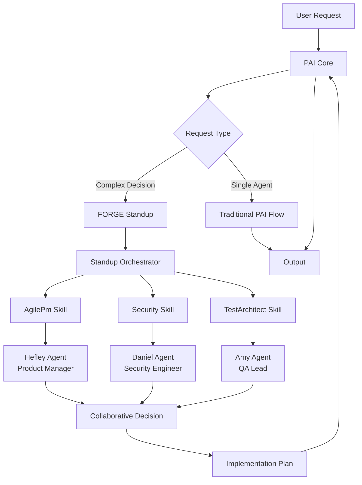

# PRD: FORGE (Fused Optimization & Reasoning for Generative Engineering)

**Created**: 2025-12-02
**Owner**: Joshua Barkley
**Status**: Approved

---

## Executive Summary

FORGE is a multi-agent collaboration layer for PAI (Personal AI Infrastructure) designed to enhance decision-making quality through coordinated specialist agents. Currently, solo developers working with single AI agents receive single-perspective solutions, often missing critical security, testing, or business concerns. This results in technical debt, security vulnerabilities, and project delays discovered too late.

FORGE solves this by introducing "standup" conversations where multiple specialist agents (Security, Testing, Business, Technical) collaboratively review decisions before implementation. Instead of fixing security issues after code review, Security agent participates in design discussions. Instead of discovering untestable code during QA, TestArchitect agent shapes implementation from user stories.

**Key Innovation**: FORGE augments PAI without replacing it. It adds:
- **Skills** (AgilePm, Security, TestArchitect) - capabilities for structured workflows
- **Agents** (Hefley, Daniel, Amy) - specialized personalities for standup conversations
- **Standup Orchestration** - multi-agent conversation layer for collaborative decisions

Success will be measured by:
1. **Standup finds 2-3x more issues** than solo agent mode (validation metric)
2. **PRD quality score ≥8/10** using objective rubric (quality gate at Week 2)
3. **0 critical security gaps** in production code (CMMC Level 2 baseline)
4. **Contribution to PAI upstream** accepted (proof it augments, not replaces)

The MVP targets **8-10 weeks** (Release 0.1), with enterprise features by **16-20 weeks** (Release 0.2) and upstream contribution by **20-25 weeks** (Release 0.3).

---

## System Architecture

### High-Level Design



### Component Details

**PAI Core** (Existing, unchanged):
- Claude Code CLI foundation
- Skills system (`.claude/skills/`)
- Agent framework
- Tool execution environment
- Technology: TypeScript, Claude API

**FORGE Layer** (New, augmentation):

1. **Skills** (Capabilities):
   - **AgilePm**: PRD creation, epic decomposition, user story generation, sprint planning
   - **Security**: Threat modeling, CMMC baseline, security requirements, vulnerability analysis
   - **TestArchitect**: Test strategy, ATDD workflows, risk scoring, coverage analysis
   - **Standup**: Multi-agent orchestration, conversation coordination, decision synthesis

2. **Agents** (Personalities):
   - **Hefley** (Product Manager): User value, business priorities, product vision
   - **Daniel** (Security Engineer): Security requirements, CMMC compliance, threat modeling
   - **Amy** (QA Lead): Test strategy, quality gates, testability analysis

3. **Standup Orchestrator**:
   - Routes complex decisions to multi-agent conversations
   - Manages turn-taking and conversation flow
   - Synthesizes agent inputs into actionable decisions
   - Updates project-context.md with decisions and rationale

### Integration Points

- **PAI Skills System**: FORGE skills install into `.claude/skills/` (standard PAI location)
- **PAI Agent Framework**: FORGE agents use PAI's agent primitives (no fork required)
- **Existing PAI Skills**: FORGE works alongside existing PAI skills (architect, engineer, researcher)
- **Upstream Contribution**: Standup orchestration contributed back to PAI if proven valuable

---

## Feature Breakdown

### Must Have (MVP - Release 0.1)

#### EPIC-001: Skills from BMAD
**User Value**: Professional agile workflows for structured project planning

1. **AgilePm Skill**
   - User Value: Transform ideas into executable plans with PRDs, epics, stories, sprints
   - Workflows: CreatePrd, CreateEpics, CreateStories, SprintPlanning
   - Templates: PRD, epic, story, sprint-status.yaml
   - Knowledge: PRD rubric, epic sizing guide

2. **Security Skill** (Basic)
   - User Value: Catch security issues during design, not after deployment
   - Workflows: ThreatModel, CmmcBaseline (5 domains)
   - Templates: Threat model, security checklist
   - Knowledge: STRIDE methodology, CMMC practices (AC, IA, SC, CM, SI)

3. **TestArchitect Skill** (Basic)
   - User Value: Test strategy before code, not after bugs appear
   - Workflows: CreateTestStrategy, DefineCoverage
   - Templates: Test plan, coverage matrix
   - Knowledge: Risk-based testing, ATDD principles

#### EPIC-002: Standup Agents
**User Value**: Specialist perspectives in every technical decision

1. **Hefley Agent (Product Manager)**
   - Personality: User-centric, prioritizes business value
   - Expertise: Product vision, user personas, MVP scoping
   - Triggers: PRD creation, epic prioritization, scope decisions

2. **Daniel Agent (Security Engineer)**
   - Personality: Security-first, CMMC-aware, proactive threat modeling
   - Expertise: OWASP Top 10, CMMC Level 2, threat modeling
   - Triggers: Architecture design, user story creation, API design

3. **Amy Agent (QA Lead)**
   - Personality: Quality-focused, testability-driven, risk-aware
   - Expertise: Test automation, ATDD, risk-based testing
   - Triggers: User story creation, technical design, deployment planning

#### EPIC-003: Standup Orchestration
**User Value**: Multi-perspective decisions reduce defects and rework

1. **Standup Workflow**
   - Triggers: Complex decisions (PRD creation, architecture design, epic breakdown)
   - Process: Present context → Agent discussion → Synthesize decision
   - Output: Decision recorded in project-context.md with rationale

2. **Context Management**
   - project-context.md as project "bible"
   - All agents reference same context during standup
   - Decisions tracked with rationale and date

3. **Decision Synthesis**
   - Orchestrator synthesizes agent inputs into actionable plan
   - Conflicts resolved through consensus (not majority vote)
   - Critical issues (security veto) halt implementation

### Should Have (v1.1 - Release 0.2)

#### Security Enhancements
1. **Full CMMC Coverage** (all 17 domains, Level 2: 110 practices)
   - User Value: Complete CMMC compliance for government contractors
2. **Security Agent Veto Authority**
   - User Value: Critical security issues halt implementation automatically
3. **Cross-Project Data Isolation**
   - User Value: Secrets from one project don't leak to another
4. **Secrets Management**
   - User Value: Credentials stored securely, not in plain text

#### Testing Enhancements
1. **ATDD Enforcement**
   - User Value: Tests written before code, reducing rework
2. **Risk Scoring Automation**
   - User Value: Automatically identify high-risk stories requiring more tests
3. **Hefley Behavioral Validation**
   - User Value: Verify agents behave as expected (persona consistency)
4. **Standup Quality Metrics**
   - User Value: Measure standup effectiveness (issues found, time saved)
5. **PRD Quality Rubric**
   - User Value: Objective PRD scoring (≥8/10 to pass validation gate)

### Could Have (Future - Release 0.3)

1. **Customizable Standup Roster**
   - User Value: Add custom agents for specific domains (legal, ops, etc.)
2. **Historical Decision Search**
   - User Value: "Why did we decide X?" answered instantly
3. **Agent Voting Mechanisms**
   - User Value: Tie-breaking when consensus fails

### Won't Have (Explicit Exclusions)

1. **PAI Replacement**
   - Reason: FORGE augments PAI, never replaces core functionality
2. **Code Generation in Standup**
   - Reason: Standup makes decisions; engineer agent implements them
3. **External Tool Integration** (Jira, GitHub Issues, etc.)
   - Reason: Keep FORGE simple; focus on decision quality, not integrations

---

## Implementation Checklist

### Setup & Infrastructure
- [x] Initialize FORGE repository
- [x] Create `.claude/skills/` directory structure
- [x] Set up git repository with .gitignore
- [ ] Configure VSCode for TypeScript development (if tools needed)
- [ ] Create LICENSE file (MIT, aligned with PAI)

### Release 0.1: MVP (Stories 1-26, 60 points)

#### Sprint 1 (Weeks 1-2): AgilePm Skill Foundation
- [x] Story 1.1: CreatePrd workflow (8 pts)
- [x] Story 1.2: CreateEpics workflow (5 pts)
- [x] Story 1.3: CreateStories workflow (8 pts)
- [x] Story 1.4: SprintPlanning workflow (5 pts)
- [x] Validation Gate (Week 2): PRD quality ≥8/10

#### Sprint 2 (Weeks 3-4): Security & TestArchitect Skills
- [ ] Story 2.1: ThreatModel workflow (8 pts)
- [ ] Story 2.2: CmmcBaseline workflow (5 pts)
- [ ] Story 2.3: CreateTestStrategy workflow (8 pts)
- [ ] Story 2.4: DefineCoverage workflow (5 pts)
- [ ] Validation Gate (Week 4): Threat model for FORGE itself

#### Sprint 3 (Weeks 5-6): Standup Agents
- [ ] Story 3.1: Hefley agent definition (3 pts)
- [ ] Story 3.2: Daniel agent definition (3 pts)
- [ ] Story 3.3: Amy agent definition (3 pts)
- [ ] Validation Gate (Week 6): Agent persona validation

#### Sprint 4 (Weeks 7-8): Standup Orchestration
- [ ] Story 4.1: Standup workflow (8 pts)
- [ ] Story 4.2: Context management (project-context.md) (3 pts)
- [ ] Story 4.3: Decision synthesis (5 pts)
- [ ] Validation Gate (Week 8): Standup finds 2-3x more issues

#### Sprint 5 (Weeks 9-10): Testing & Refinement
- [ ] Story 5.1: A/B testing setup (5 pts)
- [ ] Story 5.2: Metrics collection (3 pts)
- [ ] Story 5.3: Documentation (3 pts)
- [ ] Story 5.4: Bug fixes and polish (5 pts)
- [ ] Final Validation Gate (Week 10): Release 0.1 complete

### Release 0.2: Enterprise (Stories S-1 to T-5, 78 points)

#### Security Stories (18 pts)
- [ ] S-1: Expand CMMC to all 17 domains (8 pts)
- [ ] S-2: Security agent veto authority (5 pts)
- [ ] S-3: Cross-project data isolation (3 pts)
- [ ] S-4: Secrets management (2 pts)

#### Testing Stories (10 pts)
- [ ] T-1: ATDD enforcement mechanism (3 pts)
- [ ] T-2: Risk scoring automation (3 pts)
- [ ] T-3: Hefley behavioral validation (2 pts)
- [ ] T-4: Standup quality metrics (1 pt)
- [ ] T-5: PRD quality rubric enforcement (1 pt)

#### Remaining EPIC-002 and EPIC-003 Stories (50 pts)
- [ ] Complete remaining standup agent features
- [ ] Complete remaining orchestration features

### Release 0.3: Upstream (Stories U-1 to U-3, 26 points)

#### Customization (13 pts)
- [ ] U-1: Customizable standup roster (8 pts)
- [ ] U-2: Historical decision search (5 pts)

#### Upstream Contribution (13 pts)
- [ ] U-3: Prepare FORGE for upstream PAI contribution (13 pts)
  - Extract standup orchestration as PAI enhancement
  - Ensure zero breaking changes to PAI core
  - Documentation for PAI maintainers
  - Submit PR to PAI repository

### Documentation
- [x] README.md (project overview)
- [x] METHODOLOGY.md (agile principles)
- [x] RELEASE-*.md (phased release plans)
- [ ] docs/PRD-FORGE.md (this document)
- [ ] docs/project-context.md (project "bible")
- [ ] docs/threat-model.md (security analysis)
- [ ] CONTRIBUTING.md (upstream contribution guide)

### Quality Assurance
- [ ] Validation Gate (Week 2): PRD quality ≥8/10
- [ ] Validation Gate (Week 4): Threat model complete
- [ ] Validation Gate (Week 6): Agent personas validated
- [ ] Validation Gate (Week 8): Standup finds 2-3x more issues
- [ ] Validation Gate (Week 10): All success metrics met

---

## Technical Specifications

### Tech Stack

- **Skills Framework**: PAI `.claude/skills/` standard
  - Skill definition: `skill.md` (TitleCase, USE WHEN, Examples)
  - Workflows: Markdown files in `workflows/` (TitleCase)
  - Templates: Markdown/YAML in `templates/`
  - Knowledge: Markdown reference docs in `knowledge/`
  - Tools: TypeScript CLIs in `tools/` (if needed)

- **Agents Framework**: PAI `.claude/agents/` standard
  - Agent definition: `agent.md` (personality, expertise, triggers)
  - Behavioral prompts: Instructions for agent persona
  - No code required (pure prompt engineering)

- **Infrastructure**: Local filesystem
  - No external services required
  - No API keys needed (uses Claude Code's existing auth)
  - Works offline (except when using Claude API)

- **Version Control**: Git
  - Repository: FORGE (standalone, augments PAI)
  - License: MIT (aligned with PAI for upstream contribution)

### Data Models

#### project-context.md (Project "Bible")
```markdown
# Project Context: [Project Name]

## Executive Summary
[What, Why, Who, When, Success]

## System Architecture
[High-level design, components, tech stack]

## Key Decisions
- Decision 1: [What, Why, When, Who]
- Decision 2: [What, Why, When, Who]

## Epics Overview
[List of epics with user value]

## Success Metrics
[Measurable targets]
```

#### sprint-status.yaml (Sprint Tracking)
```yaml
project:
  name: "Project Name"
  team_velocity: 20

sprints:
  - sprint_number: 1
    goal: "Sprint goal"
    stories:
      - story_id: "1.1"
        title: "Story title"
        points: 5
        status: "pending" # pending | in_progress | done | blocked

    metrics:
      planned_points: 20
      completed_points: 0
      velocity: 0
```

### API Design

**No external APIs**. FORGE uses PAI's existing Skill tool for workflow invocation:

```typescript
// User invokes skill
/skill AgilePm
Create a PRD for user authentication system

// PAI routes to CreatePrd workflow
// Workflow uses Read, Write, AskUserQuestion tools
// Output: PRD document created
```

**Standup Orchestration** (internal coordination):
```yaml
standup_flow:
  1. User triggers standup: "Review this architecture design"
  2. Standup orchestrator loads project-context.md
  3. Orchestrator spawns agents: Hefley, Daniel, Amy
  4. Each agent reviews design and provides feedback
  5. Orchestrator synthesizes feedback into decision
  6. Decision recorded in project-context.md
  7. User receives synthesized recommendations
```

---

## Success Metrics & Timeline

### Success Metrics

1. **Standup Effectiveness** (Primary validation metric)
   - Target: Standup finds **2-3x more issues** than solo agent mode
   - Measurement: A/B testing (same task, solo vs standup)
   - Example: Solo finds 5 issues, standup finds 10-15 issues
   - Gate: If <2x, rework standup orchestration

2. **PRD Quality** (Quality gate)
   - Target: PRD quality score **≥8/10** using objective rubric
   - Measurement: Self-review + peer review using prd-rubric.md
   - Rubric categories: Executive Summary, Architecture, Features, Checklist, Clarity
   - Gate: If <8/10, improve PRD workflow

3. **Security Coverage** (CMMC compliance)
   - Target: **0 critical security gaps** in production code
   - Measurement: Daniel agent veto count (should catch all critical issues)
   - CMMC Level 2: 110 practices (Release 0.2)
   - Gate: If critical gaps slip through, improve Security skill

4. **Upstream Contribution** (Proof of augmentation principle)
   - Target: **Standup orchestration accepted** into PAI upstream
   - Measurement: PR merged into PAI repository (Release 0.3)
   - Success: Proves FORGE augments PAI without replacing it
   - Gate: If rejected, revisit augmentation architecture

### Timeline & Milestones

| Milestone | Deliverable | Target Date | Owner | Status |
|-----------|-------------|-------------|-------|--------|
| **Release 0.1: MVP** |
| Sprint 1 Complete | AgilePm skill (4 workflows) | Week 2 (Dec 15) | Joshua | ✅ Complete |
| Sprint 2 Complete | Security & TestArchitect skills | Week 4 (Dec 29) | Joshua | ⏳ Pending |
| Sprint 3 Complete | Standup agents (3 agents) | Week 6 (Jan 12) | Joshua | ⏳ Pending |
| Sprint 4 Complete | Standup orchestration | Week 8 (Jan 26) | Joshua | ⏳ Pending |
| Sprint 5 Complete | Testing & refinement | Week 10 (Feb 9) | Joshua | ⏳ Pending |
| **Validation Gate** | Standup finds 2-3x issues | Week 10 (Feb 9) | Joshua | ⏳ Pending |
| **Release 0.2: Enterprise** |
| Security Stories | Full CMMC, veto, isolation, secrets | Week 14 (Mar 8) | Joshua | ⏳ Pending |
| Testing Stories | ATDD, risk scoring, metrics | Week 16 (Mar 22) | Joshua | ⏳ Pending |
| Remaining Stories | Complete EPIC-002, EPIC-003 | Week 20 (Apr 19) | Joshua | ⏳ Pending |
| **Release 0.3: Upstream** |
| Customization | Roster, search | Week 22 (May 3) | Joshua | ⏳ Pending |
| Upstream Prep | Extract, document, PR | Week 25 (May 24) | Joshua | ⏳ Pending |
| **Final Milestone** | FORGE v1.0 released | Week 25 (May 24) | Joshua | ⏳ Pending |

**Total Timeline**: 20-25 weeks (5-6 months)

---

## Risks & Mitigation

| Risk | Impact | Probability | Mitigation |
|------|--------|-------------|------------|
| **Standup doesn't find 2-3x issues** (fails validation) | High | Medium | A/B test early (Week 8), pivot orchestration if needed |
| **Agent personalities not consistent** (behave out of character) | Medium | Medium | T-3: Hefley behavioral validation (Release 0.2) |
| **CMMC coverage too complex** (110 practices is large scope) | Medium | Medium | Start with 5 domains (MVP), expand in Release 0.2 |
| **PAI upstream rejects contribution** (architectural mismatch) | Medium | Low | Engage PAI maintainers early, ensure zero breaking changes |
| **Timeline underestimated** (solo developer, 164 pts) | Medium | High | Already mitigated: phased releases, realistic velocity (8-10 pts/week) |
| **Scope creep** (add features not in plan) | Medium | Medium | Strict MoSCoW prioritization, defer to future releases |
| **Security veto too aggressive** (blocks valid work) | Low | Medium | S-2: Configurable veto thresholds (Release 0.2) |
| **Cross-project data leak** (secrets exposed) | High | Low | S-3: Data isolation (Release 0.2), manual review until automated |

---

## Open Questions

- [x] ~~Should FORGE fork PAI or augment it?~~ → **Augment** (proven by upstream contribution goal)
- [x] ~~What agile methodology to use?~~ → **Scrum** (2-week sprints, standup terminology)
- [x] ~~How many CMMC domains in MVP?~~ → **5 domains** (expand to 17 in Release 0.2)
- [ ] What A/B testing framework for standup validation? → Decide in Sprint 5
- [ ] How to measure "issues found" objectively? → Define rubric in Story 5.2
- [ ] Should standup be synchronous or async? → Test both in Sprint 4

---

## Appendix

### User Personas

**Persona 1: Solo Developer (Primary)**
- Role: Full-stack developer, startup founder, OSS maintainer
- Goals: Ship quality code fast, avoid technical debt, learn best practices
- Pain Points: "I miss security issues because I'm not a security expert"
- Needs: Expert advice during design, not just code review
- FORGE Value: Standup gives expert perspectives without hiring a team

**Persona 2: Small Team Lead (Secondary)**
- Role: Tech lead, 2-4 developers, startup/agency
- Goals: Consistent quality across team, knowledge sharing, faster onboarding
- Pain Points: "Junior devs ship code without considering security or testability"
- Needs: Built-in quality gates, educational feedback
- FORGE Value: Standup teaches best practices through agent feedback

**Persona 3: Government Contractor (Secondary)**
- Role: Developer for government projects requiring CMMC compliance
- Goals: Pass CMMC audits, implement security controls correctly
- Pain Points: "CMMC has 110 practices; I don't know which apply to my feature"
- Needs: Automated CMMC guidance per feature
- FORGE Value: Daniel agent maps features to CMMC practices automatically

### References

- PAI Architecture: `.claude/` directory structure, skill system, agent framework
- BMAD Method: Agile patterns extracted into AgilePm skill
- CMMC Level 2: 110 practices across 17 domains (AC, AU, AT, CA, CM, CP, IA, IR, MA, MP, PE, PS, RA, RE, SA, SC, SI)
- OWASP Top 10: Security threats (XSS, SQL injection, broken auth, etc.)
- STRIDE: Threat modeling methodology (Spoofing, Tampering, Repudiation, Info Disclosure, DoS, Elevation)
- INVEST: User story principles (Independent, Negotiable, Valuable, Estimable, Small, Testable)

---

**PRD Version**: 1.0
**Last Updated**: 2025-12-02
**Next Review**: 2025-12-15 (Week 2 validation gate)
